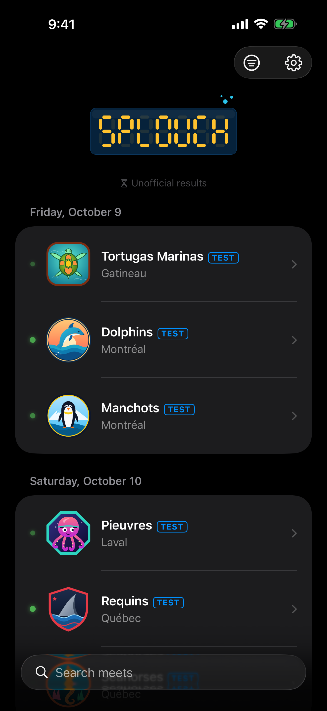
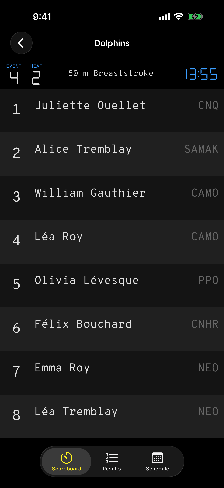
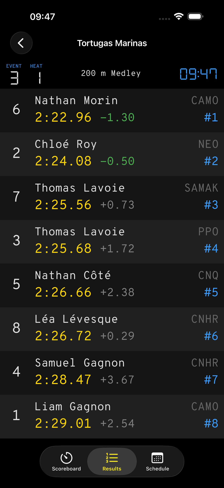
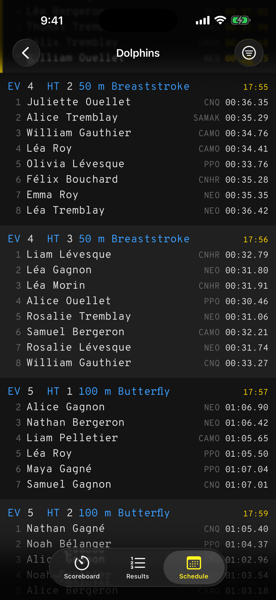
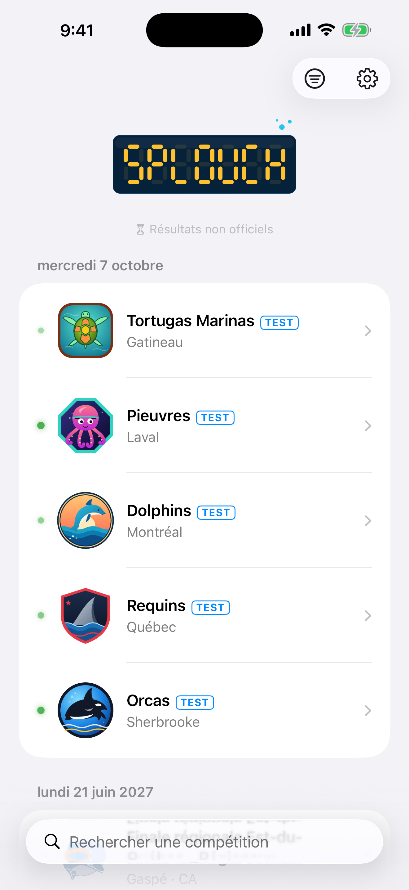
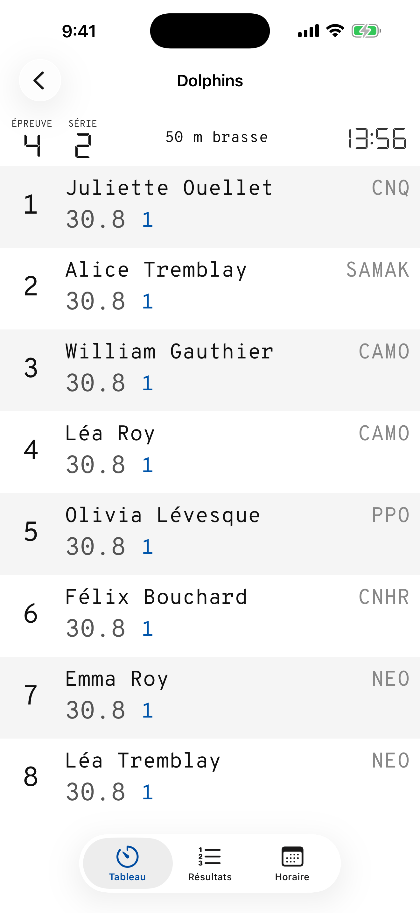
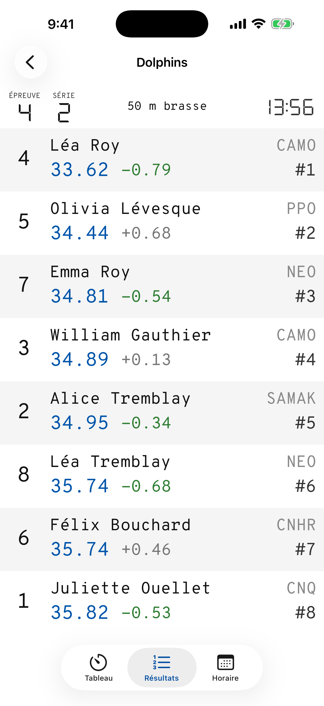
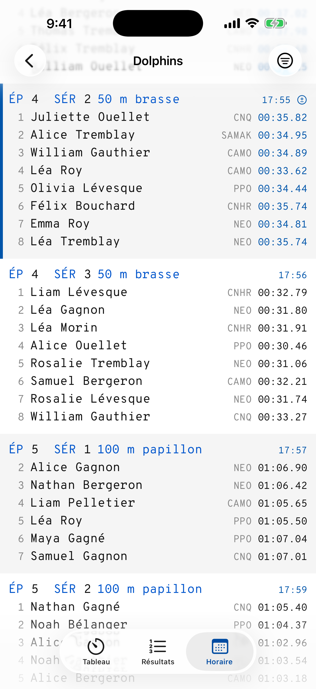

# Splouch for iOS

The spectator app for [Splouch](https://github.com/olivierouellet/Splouch), the live
swimming scoreboard for timing consoles.

Pick a meet from the cloud, or from the pool's own server on the venue's wifi, and
follow it from the stands: the live scoreboard with the race clock, splits and
places as they land, each heat's results, and the meet's schedule. The app speaks
English, French and Spanish, follows each meet's own theme, and runs on iPhone and
iPad (iOS 17 or later).

---

## Screenshots

| Meets | Scoreboard | Results | Schedule |
| --- | --- | --- | --- |
|  |  |  |  |
|  |  |  |  |

Swimmers, clubs and times are fictional (a bundled test recording). Every screen
in English and French, light and dark, on iPhone and iPad is in
[`Screenshots/`](Screenshots/).

---

## Related repositories

| | |
| --- | --- |
| [Splouch](https://github.com/olivierouellet/Splouch) | Scoreboard server, TV kiosk and cloud relay; holds the app and API contracts |
| [Splouch-android](https://github.com/olivierouellet/Splouch-android) | Spectator app for Android |

---

## Documentation

| | |
| --- | --- |
| [Development](docs/development.md) | The contracts, code layout, building and testing, local servers, strings |
| [Simulator](emulator.md) | Booting, installing, launching against a local server, driving and capturing |
| [Parity ledger](parity.md) | One row per feature ID: built here or not, and why |
| [Screenshots](Screenshots/README.md) | What is captured, the App Store set, recapturing |

---

## Community

| | |
| --- | --- |
| [Contributing](CONTRIBUTING.md) | The contracts, setup, the checks a PR must pass, conventions, reporting a bug |
| [Security](SECURITY.md) | Reporting a vulnerability, what the app assumes about the network it is on |
| [Code of Conduct](CODE_OF_CONDUCT.md) | Contributor Covenant 2.1 |

---

## License

MIT. See [LICENSE](LICENSE).
